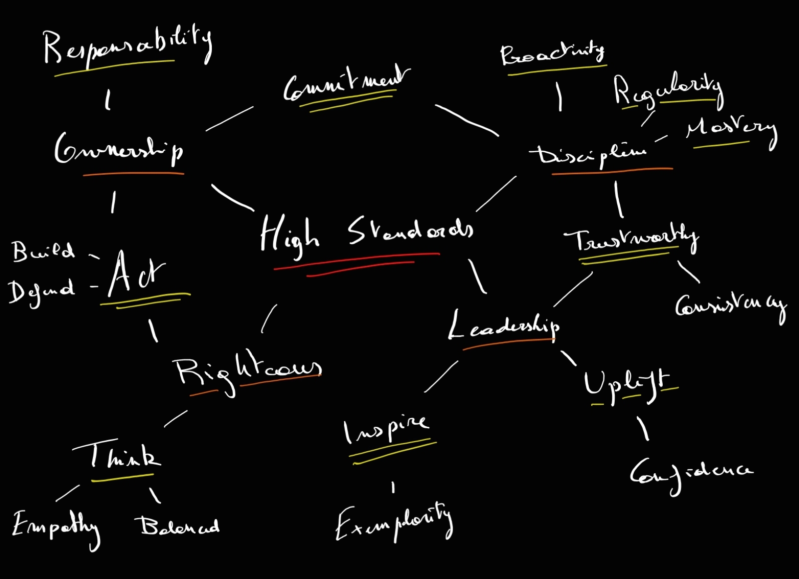

# Value Mapping for better Goal Planning. 

When we set goals for ourselves, we often think about the "How": Starting a good habit or stopping a bad one. Often, we rely on motivation, but when it fades, so do those resolutions. In the previous months, I started to realize that focusing too much on those "Hows" might be counterproductive:
- The need for that goal is often coming from external sources and doesn't directly originate from us. "Maybe I should lose some weight for that event".
- They are often taken "in a vacuum", without a real underlying buy-in. "I guess doing some sport is also good for health".
- We "push" ourselves towards the goals, instead of trying to "pull" them to us. "Ok, so what sport ? What program ? And what equipment ?".

Instead, I've started to think about the "WHY". And not the generic/one-size-fits-all "why" like "Be Healthy". The real whys. The values that you have, the ones that you want, or even those of your role models. Think about the things that anger you: do hate injustice? Maybe fairness is one of those then. 

Great, now you have some ideas of your "Core Values". Now, find other values and try to find links and relations between them. Do some of them require others? Maybe some help to build others? Value after value, find what sparks your inner fire for something greater and you'll create your own value map.

Then, what about those goals? Well, now you have something way more powerful than mere globally accepted goals. Now you have a motive built upon what you truly can become. Maybe it was never about losing some weight or earning that promotion. Maybe it was all about how you can try to apply all those values in every single aspect of your daily life. But guess what? Living that highly driven life might also come with a more active life, less time to be bored, and killing time with those old bad habits.

A very similar parallel is like starting a business. If you focus much more on making money than the core business, the customer relationship, and the value it brings, you might not make a lot of it.

As an example, here is my current value map. It's not meant to be final, words can be interpreted in many different ways, and you might not have the same priorities at all, but it's a good example to see how things can get interconnected and how a single "core value" (High Standards) can span into a coherent set of smaller traits.

